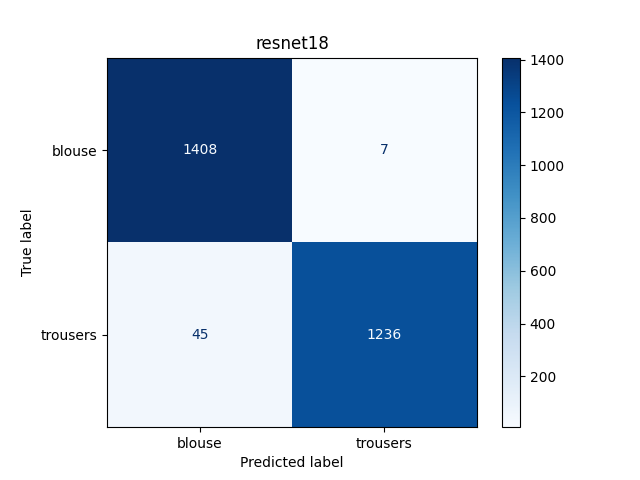

# GarmentCV

**GarmentCV** is an application that attempts to classify blouses and trousers based on their picture
by using pre-trained CV models.

## Dataset

Dataset was downloaded via `opendatasets` library
from [this](https://www.kaggle.com/competitions/lamoda-images-classification/) Kaggle competition:

```python
import opendatasets

url = "https://www.kaggle.com/competitions/lamoda-images-classification/"
opendatasets.download(url)
```

You can run [data_research.py](data_research.py) file to see some info
about [training](lamoda-images-classification/images/train) and
[testing](lamoda-images-classification/images/test) datasets.

Research tells us that the dataset is of very high quality:

* no corrupted files
* all files have the same extension
* there are only two image sizes (`46x66` and `600x866`) which are pretty balanced in amount
* classes could be considered balanced

I was unable to notice any outliers or incorrectly labeled data at a quick glance, and so
further we will operate under the assumption that all data is correct and of high quality.

That said, no data cleaning will be performed at this stage.

## Models

Classification of images with different objects is a famously known task,
and there are lots of different neural nets with different configurations that
are suitable for this.

`GarmentCV` provides three models:

* `EfficientNetB0`
* `ResNet18`
* `ResNet34`

For the sake of efficiency (almost a pun, considering first model name)
we are using pre-computed weights (from [ImageNet1K](https://www.image-net.org/)).

## Training

### Augmentations

In computer vision classification, augmentations are quite essential
for ensuring stability of training.

The augmentation pipeline is as follows:

1. images are resized and cropped,
2. training images are additionally distorted by rotating, flipping and color jittering
3. images are transformed to tensors
4. tensors are normalized by ImageNet mean and std

Training augmentations could enhance models performance by training them to be
flexible and not dependent on the dataset peculiarities.

### Fitting and validation

Fitting of model was done using `AdamW` optimizer,
learning rate that was exponentially decreasing from `0.01` with `0.8` coefficient
for `5` epochs.

To validate results of fitting,
validation dataset was extracted from given training data (80/20 division).
After each epoch of fitting model was evaluated on validation dataset.

That helped to notice that every model was performing almost perfect even after first epoch.
It could be that the task is fairly easy for neural networks of that level.

### Metrics

#### EfficientNetB0


| Accuracy | Precision | Recall | F1-score |  
|:--------:|:---------:|:------:|:--------:|  
|   1.00   |   1.00    |  1.00  |   1.00   |

#### ResNet18



| Accuracy | Precision | Recall | F1-score |  
|:--------:|:---------:|:------:|:--------:|  
|   0.98   |   0.98    |  0.98  |   0.98   |

#### ResNet34


| Accuracy | Precision | Recall | F1-score |  
|:--------:|:---------:|:------:|:--------:|  
|   0.99   |   0.99    |  0.99  |   0.99   |

## Results

As we can see, all models performed extremely well.

I have tried to re-train models several times, and some of the times their results
were comparably equal.
But, nonetheless, `EfficientNetB0` was most commonly a winner and
`ResNet18` usually was falling short of `ResNet34` which is due to more complex architecture.

## Usage

This project also offers an interactive component in [main.py](main.py) file.

```commandline
python main.py
```

You can choose a model, either load it from pre-trained versions or train it on your own,
and use that model to classify all the images in your specified folder.

The code is structured in a way that makes it easy to extend and modify,
and you are encouraged to play with it in any way you want.

## Contributions

Feel free to star this repository if you liked this research or if you are interested in it;
in case of latter you are also welcome to contact our with your suggestions or questions.
